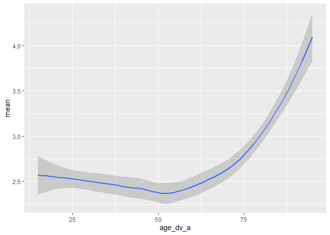

Statistical assignment 3
================
Nina Cunningham (680028420)
Tuesday 18th February

In this assignment we will explore political interest (*vote6*) and how it changes over time.

Read data
---------

First we want to read and join the data for the first 7 waves of the Understanding Society. (Wave 8 does not have a variable for political interest). We only want five variables: personal identifier, sample origin, sex, age and political interest. It is tedious to join all the seven waves manually, and it makes sense to use a loop in this case. Since you don't yet know about iteration I'll provide the code for you; please see the explanation of the code here: <http://abessudnov.net/dataanalysis3/iteration.html>.

The only thing you need to do for this code to work on your computer is to provide a path to the directory where the data are stored on your computer.

``` r
library(tidyverse)
library(data.table)

# data.table is faster compared to readr so we'll use it in this case (the function fread()). You need to install this package first to be able to run this code.

# create a vector with the file names and paths

files <- dir(
             # Select the folder where the files are stored.
             "C:/Users/ninaj/Documents/datan3/datan3-master/UKDA-6614-tab/tab",
             # Tell R which pattern you want present in the files it will display.
             pattern = "indresp",
             # We want this process to repeat through the entire folder.
             recursive = TRUE,
             # And finally want R to show us the entire file path, rather than just
             # the names of the individual files.
             full.names = TRUE)

# Select only files from the UKHLS.
files <- files[stringr::str_detect(files, "ukhls")]
files
```

    ## [1] "C:/Users/ninaj/Documents/datan3/datan3-master/UKDA-6614-tab/tab/ukhls_w1/a_indresp.tab"
    ## [2] "C:/Users/ninaj/Documents/datan3/datan3-master/UKDA-6614-tab/tab/ukhls_w2/b_indresp.tab"
    ## [3] "C:/Users/ninaj/Documents/datan3/datan3-master/UKDA-6614-tab/tab/ukhls_w3/c_indresp.tab"
    ## [4] "C:/Users/ninaj/Documents/datan3/datan3-master/UKDA-6614-tab/tab/ukhls_w4/d_indresp.tab"
    ## [5] "C:/Users/ninaj/Documents/datan3/datan3-master/UKDA-6614-tab/tab/ukhls_w5/e_indresp.tab"
    ## [6] "C:/Users/ninaj/Documents/datan3/datan3-master/UKDA-6614-tab/tab/ukhls_w6/f_indresp.tab"
    ## [7] "C:/Users/ninaj/Documents/datan3/datan3-master/UKDA-6614-tab/tab/ukhls_w7/g_indresp.tab"
    ## [8] "C:/Users/ninaj/Documents/datan3/datan3-master/UKDA-6614-tab/tab/ukhls_w8/h_indresp.tab"
    ## [9] "C:/Users/ninaj/Documents/datan3/datan3-master/UKDA-6614-tab/tab/ukhls_w9/i_indresp.tab"

``` r
# create a vector of variable names
vars <- c("memorig", "sex_dv", "age_dv", "vote6")

for (i in 1:7) {
        # Create a vector of the variables with the correct prefix.
        varsToSelect <- paste(letters[i], vars, sep = "_")
        # Add pidp to this vector (no prefix for pidp)
        varsToSelect <- c("pidp", varsToSelect)
        # Now read the data. 
        data <- fread(files[i], select = varsToSelect)
        if (i == 1) {
                all7 <- data  
        }
        else {
                all7 <- full_join(all7, data, by = "pidp")
        }
        # Now we can remove data to free up the memory.
        rm(data)
} 
```

Reshape data (20 points)
------------------------

Now we have got the data from all 7 waves in the same data frame **all7** in the wide format. Note that the panel is unbalanced, i.e. we included all people who participated in at least one wave of the survey. Reshape the data to the long format. The resulting data frame should have six columns for six variables.

``` r
Long <- all7 %>%
  gather(a_memorig:g_vote6, key = "variable", value = "value") %>%
  separate(variable, into = c("wave", "variable"), sep = "_", extra = "merge") %>%
  spread(key = variable, value = value)
```

Filter and recode (20 points)
-----------------------------

Now we want to filter the data keeping only respondents from the original UKHLS sample for Great Britain (memorig == 1). We also want to clean the variables for sex (recoding it to "male" or "female") and political interest (keeping the values from 1 to 4 and coding all negative values as missing). Tabulate *sex* and *vote6* to make sure your recodings were correct.

``` r
Long <- Long %>%
        filter(memorig == 1) %>%
        mutate(sex_dv = ifelse(sex_dv == 1, "male",
                               ifelse(sex_dv == 2, "female", NA)),
        vote6 = ifelse(vote6 < 0, NA, vote6))
 


table(Long$sex_dv)
```

    ## 
    ## female   male 
    ## 117665 100342

``` r
table(Long$vote6)
```

    ## 
    ##     1     2     3     4 
    ## 21660 70952 56134 52145

Calculate mean political interest by sex and wave (10 points)
-------------------------------------------------------------

Political interest is an ordinal variable, but we will treat it as interval and calculate mean political interest for men and women in each wave.

``` r
meanVote6 <- Long %>%
  group_by(sex_dv, wave) %>%
  filter(!is.na(sex_dv)) %>%
  summarise(mean = mean(vote6, na.rm = TRUE))
```

Reshape the data frame with summary statistics (20 points)
----------------------------------------------------------

Your resulting data frame with the means is in the long format. Reshape it to the wide format. It should look like this:

| sex\_dv | a   | b   | c   | d   | e   | f   | g   |
|---------|-----|-----|-----|-----|-----|-----|-----|
| female  |     |     |     |     |     |     |     |
| male    |     |     |     |     |     |     |     |

In the cells of this table you should have mean political interest by sex and wave.

Write a short interpretation of your findings.

``` r
meanVote6 <- meanVote6 %>%
  spread(wave, mean)

meanVote6
```

    ## # A tibble: 2 x 8
    ## # Groups:   sex_dv [2]
    ##   sex_dv     a     b     c     d     e     f     g
    ##   <chr>  <dbl> <dbl> <dbl> <dbl> <dbl> <dbl> <dbl>
    ## 1 female  2.84  2.82  2.87  2.89  2.87  2.81  2.73
    ## 2 male    2.53  2.51  2.54  2.55  2.51  2.47  2.42

Overall men seem to have more political interest compared to women over all of the waves. Men are also more consistently interested whereas women seem to vary a lot. This may be due to many factors including a lack of female role models in politics and an isolation from political conversations both in the political sphere and also the social one. This can also be reproduced in stereotyped where men are more encouraged to discuss politics than women.

Estimate stability of political interest (30 points)
----------------------------------------------------

Political scientists have been arguing how stable the level of political interest is over the life course. Imagine someone who is not interested in politics at all so that their value of *vote6* is always 4. Their level of political interest is very stable over time, as stable as the level of political interest of someone who is always very interested in politics (*vote6* = 1). On the other hand, imagine someone who changes their value of *votes6* from 1 to 4 and back every other wave. Their level of political interest is very unstable.

Let us introduce a measure of stability of political interest that is going to be equal to the sum of the absolute values of changes in political interest from wave to wave. Let us call this measure Delta. It is difficult for me to typeset a mathematical formula in Markdown, but I'll explain this informally.

Imagine a person with the level of political interest that is constant over time: {1, 1, 1, 1, 1, 1, 1}. For this person, Delta is zero.

Now imagine a person who changes once from "very interested in politics" to "fairly interested in politics": {1, 1, 1, 1, 2, 2, 2}. For them, Delta = (1 - 1) + (1 - 1) + (1 - 1) + (2 - 1) + (2 - 2) + (2 - 2) = 1.

Now imagine someone who changes from "very interested in politics" to "not at all interested" every other wave: {1, 4, 1, 4, 1, 4, 1}. Delta = (4 - 1) + abs(1 - 4) + (4 - 1) + abs(1 - 4) + (4 - 1) + abs(1 - 4) = 3 \* 6 = 18.

Large Delta indicates unstable political interest. Delta = 0 indicates a constant level of political interest.

Write the R code that does the following.

1.  To simplify interpretation, keep only the respondents with non-missing values for political interest in all seven waves.
2.  Calculate Delta for each person in the data set.
3.  Calculate mean Delta for men and women.
4.  Calculate mean Delta by age (at wave 1) and plot the local polynomial curve showing the association between age at wave 1 and mean Delta. You can use either **ggplot2** or the *scatter.smooth()* function from base R.
5.  Write a short interpretation of your findings.

``` r
Delta <- Long %>%
  pivot_wider(id_cols = c(pidp, sex_dv), names_from = wave, values_from = c(age_dv, vote6)) 

Delta <- Delta %>%
  drop_na() %>%
  select(-age_dv_b:-age_dv_g)

Delta <- Delta %>%
  mutate(delta = abs(vote6_b - vote6_a) + abs(vote6_c - vote6_b) + abs(vote6_d - vote6_c)+ abs(vote6_e - vote6_d) + abs(vote6_f - vote6_e) + abs(vote6_g - vote6_f))

gmDelta <- Delta %>%
  group_by(sex_dv) %>%
  summarise(mean = mean(delta))

gmDelta
```

    ## # A tibble: 2 x 2
    ##   sex_dv  mean
    ##   <chr>  <dbl>
    ## 1 female  2.49
    ## 2 male    2.53

``` r
library(ggplot2)

aDelta <- Delta %>%
  group_by(age_dv_a) %>%
  summarise(mean = mean(delta)) %>%
  ggplot(aes(x = age_dv_a, y = mean)) + 
    stat_smooth(method='loess', formula = y~x)

aDelta
```



Men had a higher mean delta suggesting that on average they are more prone to change their interest in politics than women. In the previous interpretation, men were shown to be more politically active suggesting that the cause of this may be from an encouragement to discuss with their male peers. This may explain why men have a slightly higher delta than women because they are encouraged to think about politics therefore, they may change their interest more in each wave as discussions continue. If women are less politically interested, then their interest in politics may vary less because they would just put the same interest each time as they are not encouraged to thing about it as much.

Age also has an effect with older people having a much higher delta than people younger than them. The delta is lowest at around 55 where people have been more consistent in their political interest, although the delta is fairly level till that point and then it begins to rise significantly. This rise suggests that age has more of an effect than gender. This effect may be caused by growing political apathy as you get older, as the highest number of votes are from middle aged people. It may also due to an inability to vote as older people gain less mobility therefore become less interested in politics as they struggle to have a say. This does depend on a decline in political interest among older people which the graph does not say however other reports have suggested this increase in political apathy among older people is accurate.
